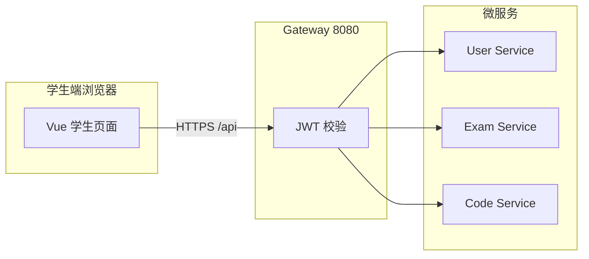

# StructExam 数据结构机考平台（学生端）测试计划

| 文档信息 | 内容 |
|---------|------|
| 项目名称 | StructExam 数据结构机考平台 |
| 测试对象范围 | 学生端 Web 应用（Vue 3 + Element Plus）及经网关访问的学生相关 API |
| 文档版本 | 1.1 |
| 编制说明 | 依据 GB/T 软件工程文档习惯与项目 `SPEC.md`、`README.md` 整理 |

---

## 1 引言

### 1.1 编写目的

本测试计划用于规定 **StructExam 学生端** 在一期范围内的测试范围、内容、资源、进度与评价方法，作为测试实施、测试评审与验收的依据。

**预期读者**：测试负责人与执行人员、项目经理、后端/前端开发、运维部署人员、教学管理方（用户代表）。

### 1.2 背景

**a.** 本测试计划从属的软件系统名称为：**StructExam 数据结构机考平台**（学生端为浏览器访问的前端应用，经 API 网关调用用户服务、考试服务、代码服务等）。

**b.** 项目为一期在线机考能力：学生可注册/登录、查看考试列表、进入考试、在 Monaco 编辑器中答题（含选择题与编程题）、代码保存/提交、交卷、查看历史与个人中心。二期规划含代码沙箱与用例判定等，本计划以 **当前仓库已实现的一期学生端功能** 为主；二期能力未上线时相关用例标记为不适用或占位。

**执行本测试计划前须完成的工作**：

- 环境：`MySQL`、`Redis`、`Nacos`、各微服务与网关、前端（或 Docker Compose 全栈）按 `README.md` 就绪并可访问。
- 数据：完成 `sql/init.sql`（及测试数据脚本，若有）初始化；存在至少一场 **已发布且在有效时间内** 的考试及学生账号，或约定由教师端/脚本预置。
- 文档：`SPEC.md` 中 API 与页面与实现一致；若有合同/任务书，以最新核准版本为准。

**用户与测试组织**：开发团队负责缺陷修复；测试组（或兼任测试的开发）负责用例设计与执行；用户方可参与确认测试（UAT）。

### 1.3 定义

| 术语/缩写 | 含义 |
|-----------|------|
| StructExam | 本项目英文代号，数据结构在线机考平台 |
| 学生端 | 学生角色使用的 Web 前端（路由含 `/home`、`/exam/:id`、`/history`、`/profile` 等） |
| Gateway | Spring Cloud Gateway，统一入口，默认 `8080` |
| JWT | JSON Web Token，网关与学生端请求鉴权载体 |
| 组装测试 | 多模块/多服务联调下的接口与流程验证 |
| 确认测试 | 对照需求验证是否可交付的测试（含 UAT） |
| E2E | End-to-End，端到端 UI 自动化测试 |
| UAT | User Acceptance Testing，用户验收测试 |
| Redis 临时代码 | 编程题作答过程中缓存于 Redis 的草稿，见 `SPEC.md` 缓存设计 |
| SLA / SLO | 服务级别协议/目标，用于非功能验收的量化约定（若合同未规定则由项目组自定基线） |
| 压力/负载测试 | 在约定硬件与数据规模下，对关键接口或全链路施加并发与吞吐，观察延迟与错误率 |
| 韧性 / 容错 | 依赖组件（某微服务、Redis、MySQL 等）异常或瞬时不可用时，系统的降级表现与可恢复性 |

### 1.4 参考资料

| 序号 | 标题 | 编号/位置 | 说明 |
|------|------|-------------|------|
| a | 《StructExam 项目规格说明书》 | 仓库根目录 `SPEC.md` | 功能、API、数据模型 |
| b | 《StructExam README》 | 仓库根目录 `README.md` | 部署、端口、启动顺序 |
| c | 本测试计划配套自动化说明 | `tests/README.md` | 如何运行 `tests` 下 Playwright 用例 |
| d | 测试数据脚本（若使用） | `sql/` 下相关 SQL | 以仓库实际文件为准 |
| e | 软件开发与测试相关标准（如适用） | GB/T 系列 | 由组织质量体系规定 |

---

## 2 计划

### 2.1 软件说明

学生端对外表现为一单页应用，经 `/api` 代理至网关。下表与示意图作为叙述后续测试计划的提纲。

**学生端主要功能与质量关注点**

| 功能域 | 功能简述 | 主要输入 | 主要输出/表现 | 质量指标关注点 |
|--------|----------|------------|----------------|----------------|
| 认证 | 登录、注册、登出 | 用户名/密码、注册表单 | Token、跳转首页/登录页 | 鉴权正确、会话过期处理 |
| 考试列表 | 分页列表、状态展示 | 分页参数 | 考试卡片/表格数据 | 列表正确、空态与错误提示 |
| 考试过程 | 进入考试、题目展示、计时 | 考试 ID、答题操作 | 题目内容、剩余时间、记录状态 | 流程完整、并发下数据一致 |
| 编程题 | Monaco 编辑、保存/提交代码 | 源码、语言、题目 ID | 保存成功提示、恢复草稿 | 不丢失草稿、接口幂等与错误码 |
| 交卷 | 提交试卷/自动交卷 | 交卷操作 | 状态变为已提交、跳转或提示 | 边界时间、重复提交 |
| 历史与个人信息 | 记录列表、个人中心 | 查询请求 | 成绩/记录展示 | 权限隔离（仅本人数据） |

**学生端与后端关系（测试范围示意）**

### 2.2 测试内容

| 标识符 | 测试内容名称 | 类型 | 目的简述 | 建议阶段与顺序 |
|--------|--------------|------|----------|----------------|
| TP-STU-01 | 学生认证与会话 | 模块功能 + 接口 | 登录/注册/登出、Token 携带与 401 跳转 | 第 1 周 |
| TP-STU-02 | 考试列表与进入考试 | 组装 + 接口 | 列表、详情、进入考试创建/更新记录 | 第 1～2 周 |
| TP-STU-03 | 答题页、代码保存与提交 | 组装 + 接口 + 极限 | 题目加载、保存/提交代码、Redis 草稿 | 第 2 周 |
| TP-STU-04 | 交卷与考试结束流程 | 确认 + 接口 | 手动交卷、超时自动交卷（若已实现） | 第 2～3 周 |
| TP-STU-05 | 历史成绩与个人中心 | 模块功能 + 接口 | 记录列表、个人信息、改密（若学生可用） | 第 3 周 |
| TP-STU-06 | 非功能测试（性能、安全、兼容、易用） | 非功能 | 响应时间、容量、鉴权与常见攻击面、浏览器/分辨率、关键路径可理解性 | 第 3～4 周或里程碑前 |
| TP-STU-07 | 分布式与韧性（网关、注册发现、依赖故障） | 非功能 + 组装 | 单点服务不可用时的错误语义、重试与恢复；与一期「无分布式事务」边界一致 | 集成环境专项 |
| TP-STU-08 | 并发与数据一致性（学生端视角） | 压力/一致性（抽样） | 多考生同时保存代码、进入考试；Redis/MySQL 与界面一致 | 有性能基线后执行 |

**说明**：接口测试可通过 Postman/自动化请求复用与 E2E 相同业务场景；编程题 **运行/判题** 属二期时，本计划中相关用例以「不适用」或「仅验证接口契约与错误处理」为限。  
**非功能/分布式**：与功能用例 **正交**；未单独通过 TP-STU-06～08 时，不宣称已做「生产级性能/高可用验收」。

### 2.3 测试 1（标识符 TP-STU-01）

**参与单位与被测部位**

- 组织：测试组执行，开发组配合定位。
- 被测部位：前端 `Login.vue`、`Register.vue`、`stores/auth.js`；网关到 `user-service` 的 `/api/auth/*` 路由。

#### 2.3.1 进度安排

| 日期（相对） | 工作内容 |
|--------------|----------|
| D-3～D-1 | 熟悉环境、核对账号、准备无效账号样本 |
| D1 | 执行用例、记录缺陷 |
| D2 | 回归修复版本 |

#### 2.3.2 条件

**a. 设备**：PC，浏览器（Chromium/Firefox/WebKit 择一或全量），可访问部署 URL。

**b. 软件**：被测前端构建或开发服务；网关与用户服务；MySQL/Redis/Nacos；测试用 **HTTP 客户端或 Playwright**（见 `tests/`）。

**c. 人员**：测试执行 1 人即可；需 1 名开发支持鉴权与网关问题；预备 **合法学生账号 1 个、非法组合若干**。

#### 2.3.3 测试资料

- `SPEC.md` 第 3.1 节认证接口说明。
- 登录/注册界面截图或录屏规范（缺陷附件）。
- 输入输出样例：正确登录返回 `code=200` 与 Token；错误密码返回业务错误信息。

#### 2.3.4 测试培训

对执行人员说明：学生端 Token 存 `localStorage`、请求头 `Authorization: Bearer`；登出后清理本地状态。培训 0.5 小时即可，材料引用 `README.md` 与 `tests/README.md`。

### 2.4 测试 2（标识符 TP-STU-02）

**参与单位与被测部位**：测试组；`Home.vue`、考试相关 API（`/api/exam/list`、`/api/exam/{id}`、`/api/exam/enter/{id}`）。

#### 2.4.1 进度安排

与 TP-STU-01 并行或紧接其后；进入考试依赖已发布考试数据，须在数据就绪后 2 个工作日内完成首轮。

#### 2.4.2 条件

与 2.3.2 相同；额外需 **至少一场可进入的考试**（时间窗内、学生被授权或公开策略以实际业务为准）。

#### 2.4.3 测试资料

考试列表分页参数样例；进入考试前后 `t_exam_record`（或等价）状态变化说明（见 `SPEC.md`）。

#### 2.4.4 测试培训

说明考试状态枚举与前端展示对应关系（未开始/进行中/已结束等以产品为准）。

### 2.5 测试 3（标识符 TP-STU-03）

**参与单位与被测部位**：测试组；`Exam.vue`、题目与代码 API（`/api/question/*`、`/api/code/*`）。

#### 2.5.1 进度安排

在进入考试用例通过后执行；含大代码量与快速连续保存的回归安排在缺陷修复后。

#### 2.5.2 条件

需含 **编程题** 的试卷；Redis 可用；若存在 WebSocket/沙箱扩展，以 sandBox 分支实际行为为准并更新用例。

#### 2.5.3 测试资料

题目 JSON 结构样例；保存/提交请求体样例（`examId`、`questionId`、`codeContent`、`language`）。

#### 2.5.4 测试培训

Monaco 基本操作；区分「保存草稿」与「提交本题」(若界面分离) 及接口路径。

### 2.6 测试 4（标识符 TP-STU-04）

**参与单位与被测部位**：测试组；交卷流程涉及 `/api/exam/submit/{id}`、可能含 `/api/code/submitAll/{examId}`（以前端调用为准）。

#### 2.6.1～2.6.4

进度在 TP-STU-03 之后集中 2 日；条件同前；资料为交卷后记录状态与禁止重复进入规则；培训重点为时间与重复交卷边界。

### 2.7 测试 5（标识符 TP-STU-05）

**参与单位与被测部位**：`History.vue`、`Profile.vue` 与 `/api/exam/record/list` 等。

条件、资料、培训：强调 **仅展示当前登录学生** 的记录；改密接口参数与错误提示与 `modules.js` 一致。

### 2.8 非功能测试（标识符 TP-STU-06）

**编写目的**：补充功能测试之外的质量属性，避免将「能用」等同于「可承载、可运维、可安全上线」。

**2.8.1 测试类型与范围**

| 子类 | 学生端/观测面 | 典型手段 | 与一期关系 |
|------|----------------|----------|------------|
| 性能效率 | 登录、考试列表、进入考试、代码保存接口的 P95/P99 延迟；错误率随并发上升曲线 | k6、JMeter、Gatling 等对网关 URL；或后端压测 + 前端抽样真实用户计时 | 建议在 **类生产配置** 下定 SLO 后执行 |
| 容量 | 同时在线考生数、Redis 键数量、连接池占满前行为 | 加压到预设并发台阶，观察网关与各服务 CPU/内存/GC | 以教学周峰值为参考 |
| 安全 | JWT 缺失/篡改/过期；HTTPS（若部署）；越权访问他人 `examId`/记录 ID | 手工 + 自动化请求负例；浏览器仅验前端不泄露 Token 到 URL | 与 OWASP 常见项对齐抽样 |
| 兼容性 | Chromium / Firefox / Safari（或组织规定矩阵）；常见分辨率 | Playwright 多 project 或手工矩阵 | 与 `tests` 中 E2E 可部分重叠 |
| 易用性/可访问性（可选） | 交卷确认、倒计时可读性、错误文案 | 走查清单、小规模用户走查 | 不阻塞一期时可降级为抽样 |

**2.8.2 进度与条件**

- **进度**：宜在核心功能 TP-STU-01～05 首轮通过后集中安排；重大版本前复测。
- **条件**：独立压测环境或与生产隔离的集群，避免影响教学数据；监控（网关日志、各服务指标、DB/Redis）可用。

**2.8.3 测试资料与培训**

- 压测脚本、场景说明（虚拟用户脚本、思考时间、数据集大小）。
- 培训：执行人员了解 **不要对生产无授权压测**；会读延迟分位数与超时配置（网关、HTTP 客户端、DB 连接池）。

### 2.9 分布式与架构韧性测试（标识符 TP-STU-07）

**说明**：StructExam 采用 **Spring Cloud Gateway + 多微服务 + Nacos + Redis + MySQL**。分布式测试在此指：**跨进程调用链**、**注册发现**、**依赖故障**下的可观测行为，而非「业务上的分布式事务」（一期以各服务内事务与最终一致为主，需在缺陷单中写明边界）。

**2.9.1 测试关注点**

| 场景 | 操作方式（示例） | 预期（原则） |
|------|------------------|--------------|
| 下游服务不可用 | 停止 `exam-service` 或 `code-service` 之一，经网关调用对应 API | 网关/全局异常处理返回 **明确 HTTP 状态与错误体**；前端有 **非白屏** 提示；日志可定位服务名 |
| 网关不可用 | 停止 gateway，学生端仍开页 | 请求失败；刷新后无法连 API（与部署方式一致）；无静默成功 |
| Nacos 抖动 | 模拟 Nacos 短暂不可达或实例摘除 | 已在运行实例行为以 **实现为准** 记录；关注是否出现大面积 503 与恢复时间 |
| Redis 不可用 | 停止 Redis 后执行依赖缓存/草稿的路径 | 与实现一致：可能降级为直连 DB 或失败；**记录为已知风险或缺陷** |
| 多实例水平扩展（若有） | 网关后多副本 user/exam/code | 会话无粘滞要求下路由均衡；无单实例写死假设导致的偶发失败 |

**2.9.2 参与单位、条件与资料**

- **参与单位**：测试 + 运维/开发（需有权启停容器或进程）。
- **条件**：可重复的 Docker Compose 或 K8s 环境；禁止未经审批的生产故障注入。
- **资料**：拓扑图（同 `SPEC.md` 架构）、各服务端口、健康检查方式（若已配置）、故障演练记录表。

### 2.10 并发与一致性（标识符 TP-STU-08）

**目的**：从 **学生端业务** 验证在并发下无灾难性错误（如错卷、串题、代码覆盖错乱）。

**内容示例**：同一用户多标签页同时保存同一题；不同用户对同一考试并发 `enter`；高频率保存代码。  
**手段**：脚本并发请求 + DB/Redis 校验 + 必要时前端双开。  
**评价**：以「不出现跨用户数据混淆」为硬线；同一用户多终端冲突以产品说明为准并写入已知限制。

---

## 3 测试设计说明

### 3.1 测试 1（标识符 TP-STU-01）

#### 3.1.1 控制

- **方式**：结合 **手工** 与 **自动化（Playwright）**；接口层可用半自动脚本。
- **顺序**：先正向登录，再负向案例，最后登出与过期 Token（可手工改 localStorage 模拟）。
- **记录**：截图、浏览器控制台与网络面板 HAR（必要时）、后端日志片段。

#### 3.1.2 输入

- 合法用户名与密码；错误密码；空字段；超长字符串（边界）；特殊字符（按需求是否允许）。

#### 3.1.3 输出

- 预期：成功登录跳转 `/home`，localStorage 含 `token`；失败时 Element Plus 消息与停留在登录页。
- 401 时跳转登录页并清除 Token。

#### 3.1.4 过程

1. 打开 `/login`，校验表单控件存在。  
2. 输入合法凭据提交，断言 URL 含 `/home`。  
3. 清除 Token 访问受保护路由，断言重定向 `/login`。  
4. （可选）使用环境变量注入账号执行完整登录 E2E，见 `tests/e2e/login-flow.spec.js`。

### 3.2 测试 2（标识符 TP-STU-02）

#### 3.2.1 控制

手工为主；列表与进入考试可对 **稳定测试环境** 录制 Playwright 脚本扩展。

#### 3.2.2 输入

分页 `pageNum`、`pageSize`；合法/非法 `examId`。

#### 3.2.3 输出

列表 `code=200` 且数据结构符合约定；进入考试成功返回后前端进入答题页；非法 ID 错误提示友好。

#### 3.2.4 过程

登录后进入 `/home`，触发列表加载；选择第一场可点考试进入；抓包核对 `enter` 请求与响应。

### 3.3 测试 3（标识符 TP-STU-03）

#### 3.3.1 控制

编程题编辑建议 **半自动**（人工确认编辑器已挂载，自动化点击保存并断言接口 200）。

#### 3.3.2 输入

短代码、较长代码、多次保存同一题。

#### 3.3.3 输出

保存成功提示；`GET` 恢复与上次一致；提交后状态符合 `SPEC.md`。

#### 3.3.4 过程

进入考试 → 打开编程题 → 修改代码 → 保存 → 刷新页面或重新进入 → 校验恢复。

### 3.4 测试 4（标识符 TP-STU-04）

控制以手工交卷为主，核对数据库记录 `submit_time` 与前端状态；自动交卷依赖定时器实现细节时记录时钟误差容忍度。

### 3.5 测试 5（标识符 TP-STU-05）

控制为登录后固定导航；输入为分页与筛选（若有）；输出仅本人数据；过程按页面清单逐项过。

### 3.6 非功能测试（标识符 TP-STU-06）

#### 3.6.1 控制

性能类以 **工具驱动、可复现脚本** 为主，每次运行固定版本号与数据量；安全与兼容以 **清单 + 抽样** 为主。

#### 3.6.2 输入

并发用户数阶梯（如 50→200→500）；混合场景比例（登录:列表:保存）；浏览器类型列表。

#### 3.6.3 输出

延迟分位数、TPS、错误率曲线；安全项通过/不通过表；兼容矩阵勾选结果。

#### 3.6.4 过程

基线空载 → 阶梯加压 → 保持峰值一段时间 → 降压，归档监控截图与原始结果文件。

### 3.7 分布式与韧性（标识符 TP-STU-07）及并发一致性（TP-STU-08）

#### 3.7.1 控制

故障注入 **逐项、可回滚**；每轮记录开始/结束时间与涉及容器/进程 ID。并发测试使用固定种子数据与账号池。

#### 3.7.2 输入

服务名与停止顺序；并发线程数与请求序列（可先读功能用例序列化）。

#### 3.7.3 输出

每项故障下：HTTP 状态、响应体片段、前端表现、是否自恢复；并发测试后 DB/Redis 关键字段快照对比。

#### 3.7.4 过程

1. 备份或克隆环境。  
2. 执行单故障场景，观察 5～15 分钟。  
3. 恢复依赖，执行冒烟（登录 + 列表）。  
4. TP-STU-08 在稳定环境跑脚本，最后做数据对账。

---

## 4 评价准则

### 4.1 范围

本计划用例覆盖学生端 **一期** 核心路径：认证、考试列表与进入、答题与代码持久化、交卷、历史与个人中心。  
**局限性**：未覆盖教师端与管理员端；未覆盖真实判题沙箱（二期）。  
**非功能/分布式**：TP-STU-06～08 为 **专项**；若未执行，则「性能容量、故障注入、并发一致性」不作为发布签字依据。云厂商侧 SLA 与机房级灾难属 **运维与业务连续性** 范畴，与软件功能缺陷区分记录。

### 4.2 数据整理

- **手工**：Excel/缺陷系统记录用例通过/失败、截图编号、构建版本号。  
- **自动**：Playwright HTML 报告与 `junit.xml`（若 CI 开启）归档；需记录 **环境 URL、数据库快照或种子脚本版本** 以便复现。

### 4.3 尺度

| 准则项 | 通过标准 |
|--------|----------|
| 功能 | P0/P1 用例 100% 通过；P2 已知缺陷经风险评估可带缺陷发布（需书面确认） |
| 接口 | 与 `SPEC.md` 约定字段一致；非 200 响应有明确 `message`（或项目统一错误体） |
| 偏离 | 同一接口同类错误文案与交互在三次抽样中一致；无未处理白屏 |
| 稳定性 | 连续执行自动化冒烟 **3 次** 无 flaky（或 flaky 已登记并修复） |
| 中断 | 单机测试允许因环境重启中断，但需记录；不将「偶发网络断开」记为功能通过 |
| 非功能（TP-STU-06） | 在约定并发下，核心接口错误率低于组织阈值（若无则默认小于 0.1%）；P95 延迟不劣于立项或上一版本基线 ±20%（需书面基线） |
| 韧性（TP-STU-07） | 单一非网关微服务停止时：系统不崩溃；返回可诊断错误；恢复后 **15 分钟内** 冒烟通过（具体以环境为准） |
| 并发一致（TP-STU-08） | 抽样场景中 **零** 跨用户数据混淆；同用户冲突行为与产品说明一致 |

### 4.4 工具与资产（非功能/分布式）

建议在组织知识库或本仓库 `tests/` 下归档：压测脚本（k6/JMeter 等）、故障演练检查表、一次完整运行的监控仪表盘导出。学生端网关压测脚本见 **`tests/jmeter/`**（`README.md`、`测试用例-JMeter学生端API.md`）。与 `tests/README.md` 中 E2E 区分：**E2E 不替代压测与故障注入**。

---

**文档结束**
